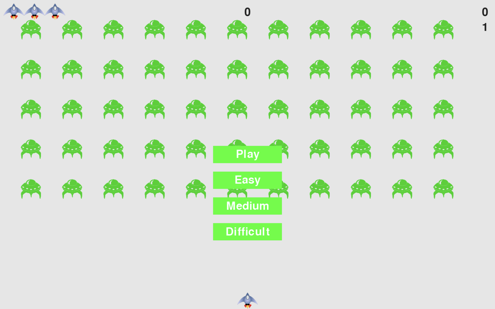

# 👽 Alien Invasion: A Python Journey

Alien Invasion is a recreation of a well-known arcade game bearing the same title. This project was undertaken as part of my journey through the "Python Crash Course" book, serving as a practical application to enhance my Python abilities.

## 🚀 Game Overview

In the game of Alien Invasion, players are put in control of a spaceship located at the bottom center of the screen. The spaceship can be maneuvered left and right using the arrow keys, and bullets can be fired with the spacebar. As the game commences, a swarm of aliens descends from the sky, moving in a pattern across and down the screen. The player's objective is to shoot and eliminate these aliens. Successfully shooting down all aliens results in the appearance of a new, faster fleet. However, if an alien collides with the player's spaceship or reaches the screen's bottom, the player loses one spaceship. The game concludes when the player has lost three spaceships. Enjoy the adventure! 😊

## 🔧 Requirements

- [Python](https://www.python.org/) 3.x +
- [Pygame](https://www.pygame.org/)

## 🎮 Controls

- Space-bar: Shoot
- Arrow keys (left - right): Move the ship left / right
- Q: (Q)uit the game
- P: Start (P)laying the game

## ⚔ Let's play

### Cloning the Repository

```bash
$ git clone https://github.com/SankalpYaduvanshi/Alien-Invasion.git
$ cd Alien-Invasion
```

### Running the Game

```bash
$ python alien_invasion.py
```

